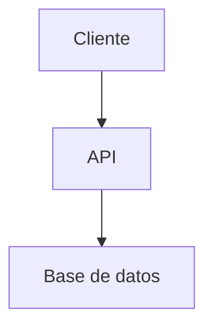

# docs/architecture.md — plantilla

Responde "cómo está construido". A diferencia de `AGENTS.md`/`MEMORY.md`, no tiene un límite estricto de líneas porque es un documento de referencia que se consulta, no uno que se relee entero cada sesión — pero igual prioriza diagramas y secciones cortas sobre prosa larga.

```markdown
# Arquitectura — [Nombre del proyecto]

[Resumen de 2-3 frases: qué tipo de sistema es (monolito, microservicios, SPA + API, etc.) y las piezas principales.]

## Componentes principales

- **[Componente A]**: [qué hace, dónde vive en el repo].
- **[Componente B]**: [qué hace, dónde vive en el repo].

## Diagrama



## Flujo de datos

[Cómo viaja una petición/operación típica de punta a punta.]

## Decisiones de diseño clave

- **[Decisión]**: [por qué se tomó, qué alternativas se descartaron].

## Restricciones y trade-offs conocidos

- [Limitación técnica o de negocio que condiciona el diseño.]

## Puntos de extensión

- [Dónde y cómo se agregan nuevas features sin romper el diseño actual.]
```

## Reglas al actualizar

- Verifica que el diagrama y los componentes descritos reflejen el código actual, no una versión anterior del proyecto.
- Si una decisión de diseño documentada aquí fue descartada o reemplazada, actualízala en vez de dejar ambas versiones.
- Los detalles de implementación que cambian frecuentemente (nombres de variables, detalles de una función) no van aquí; esto es para la vista de alto nivel que no cambia cada semana.
